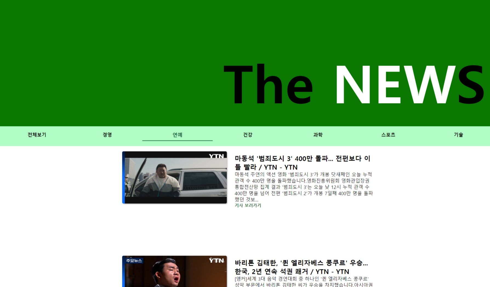
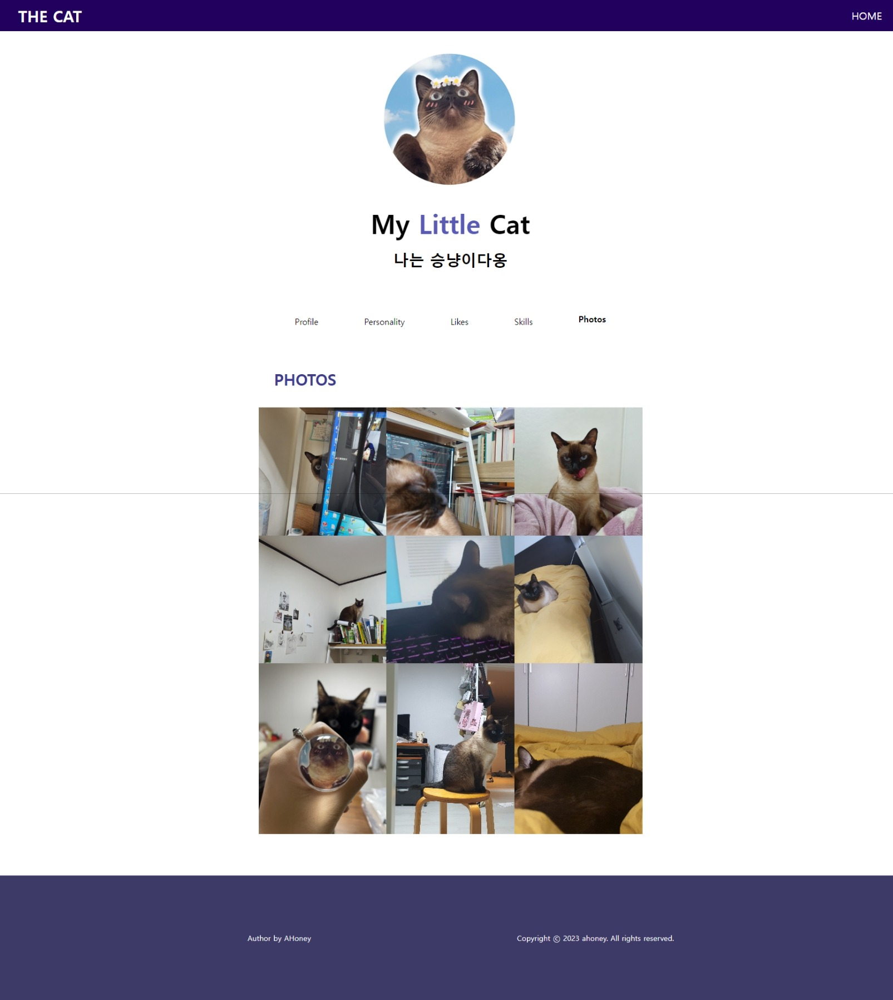
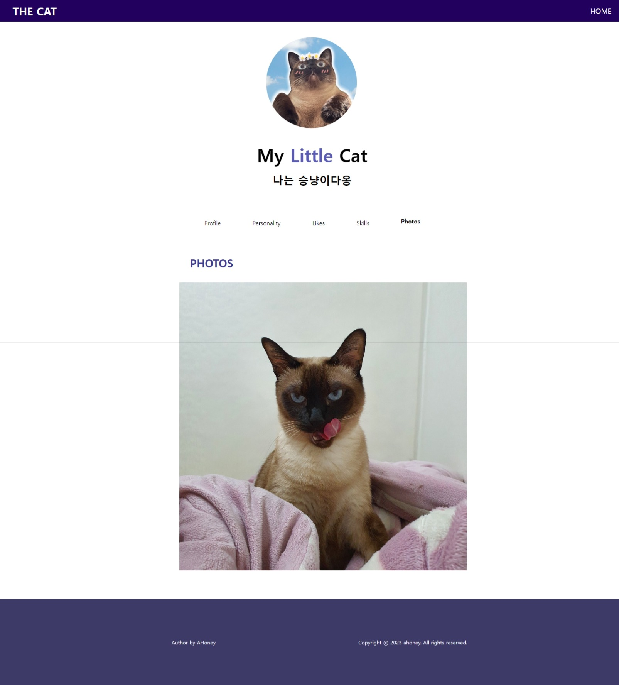
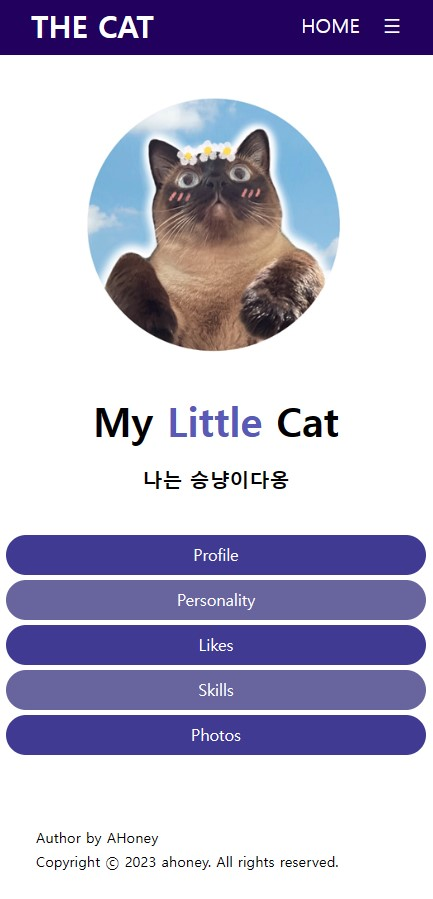
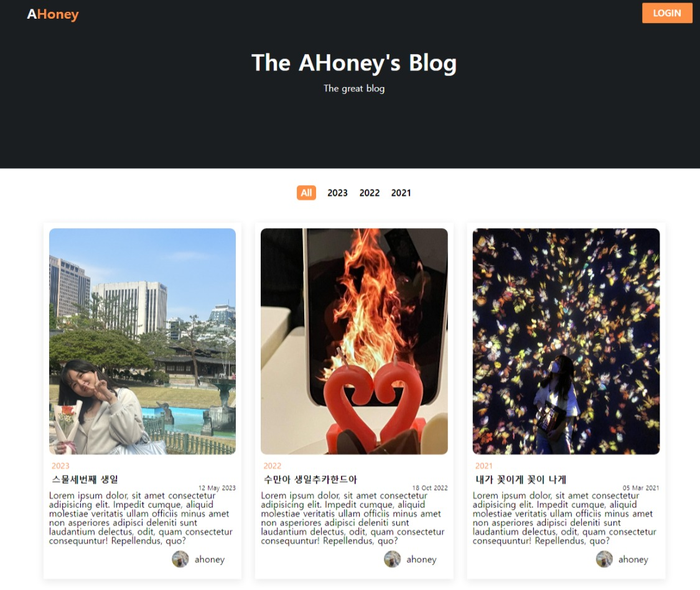
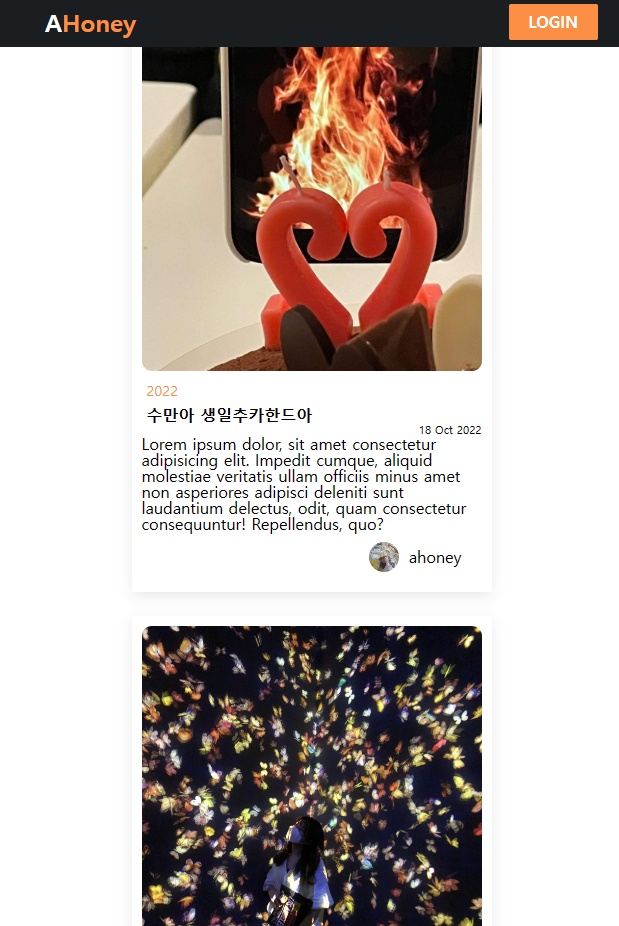
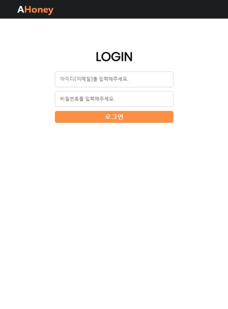
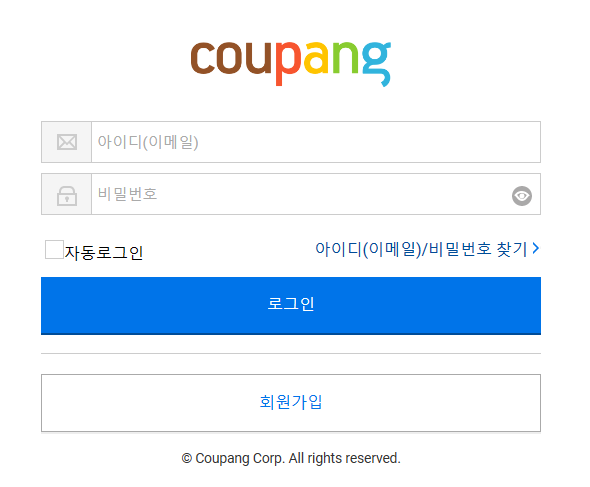
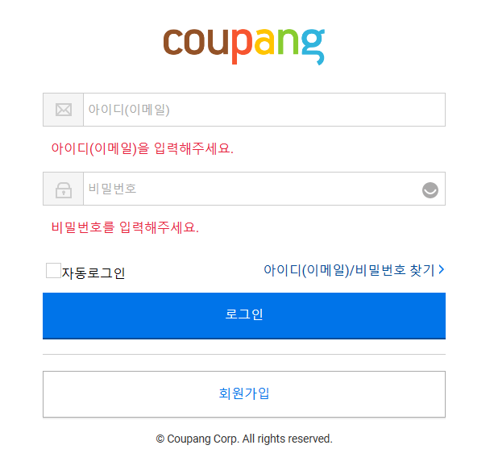
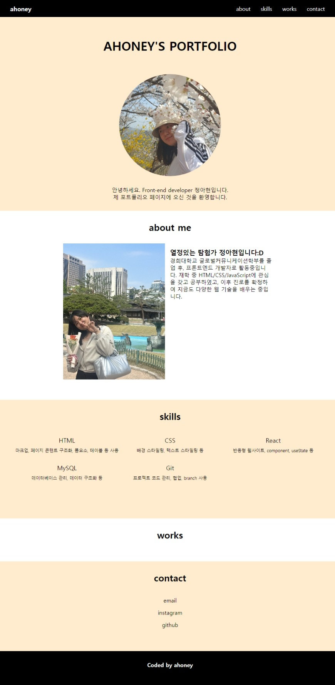

## **MY_CAT**

  

with react

    <a href="https://blog.naver.com/5128233/223121207741">동영상으로 보기</a>

## **MY_CAT**

  
  
  

  <a href="https://blog.naver.com/5128233/223114756735">동영상으로 보기</a>

## **BLOG**

  
  
  

## **COPANG_LOGIN**

  
  

## **PORTFOLIO**

  

## **YOUTUBE**

  
  

